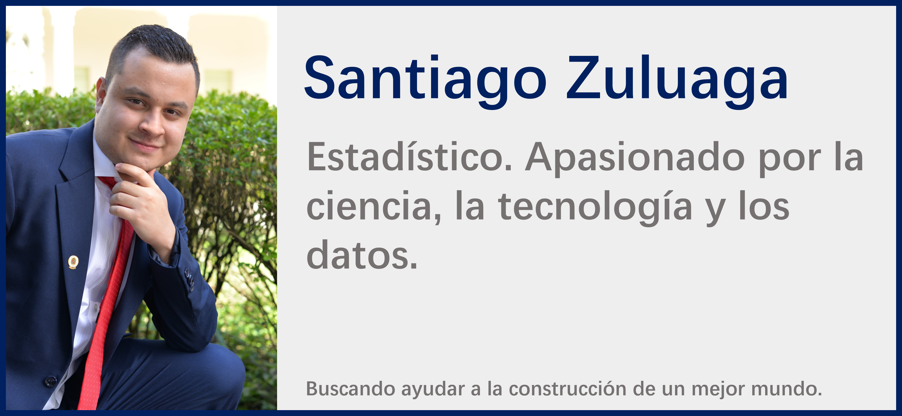
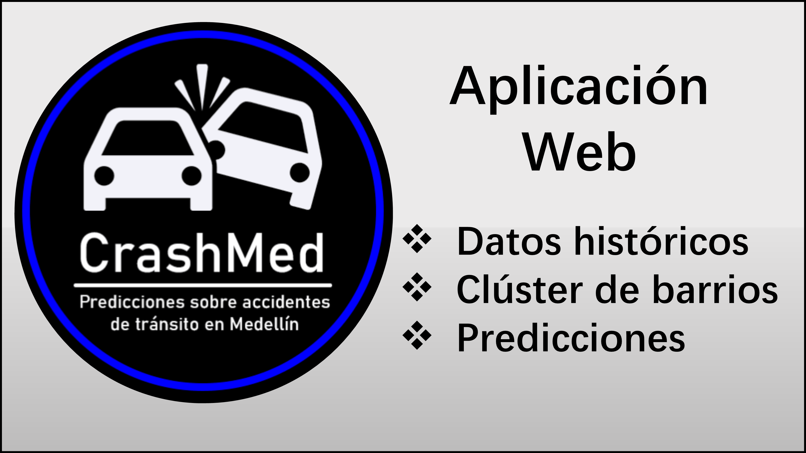
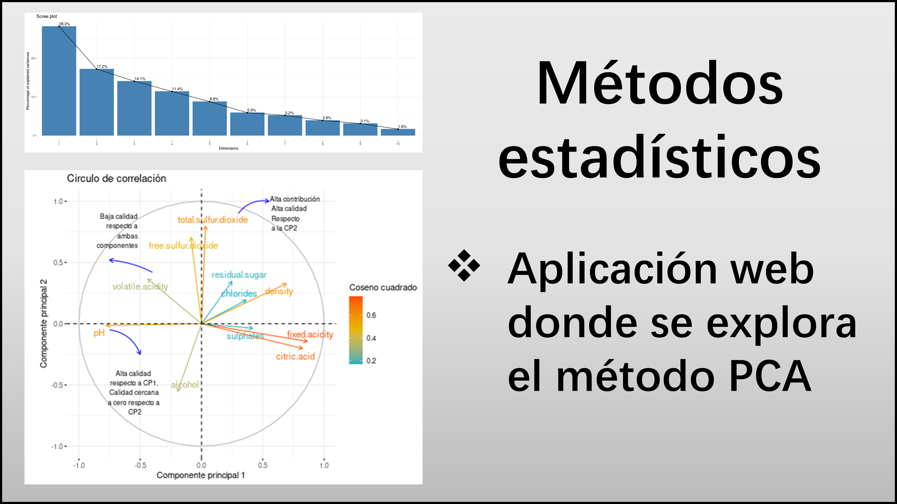
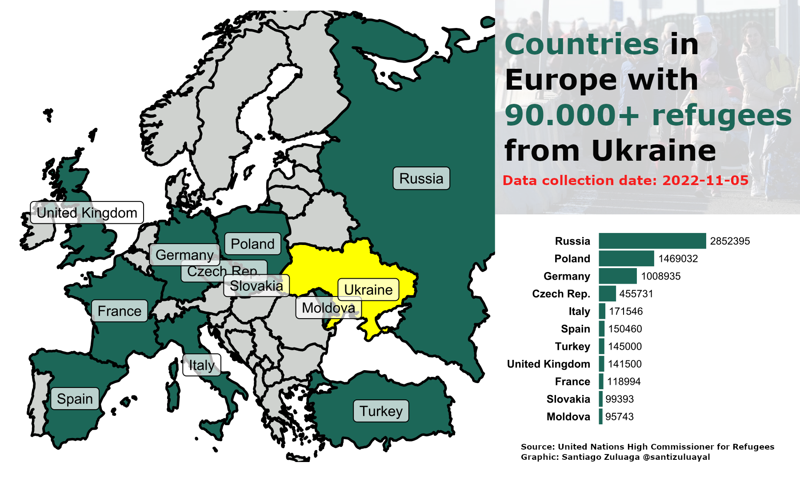
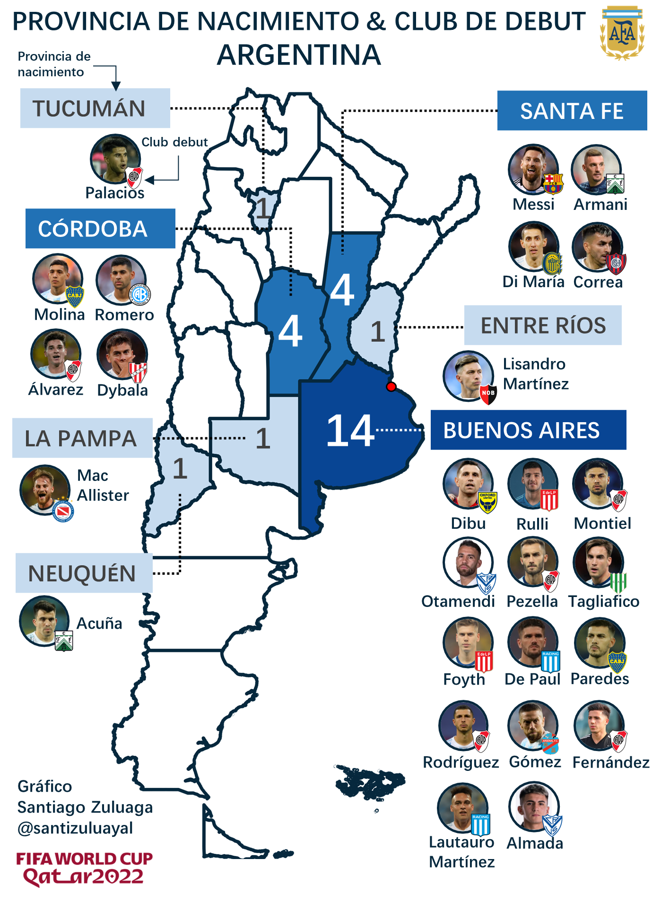
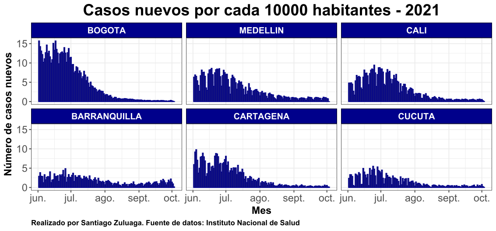
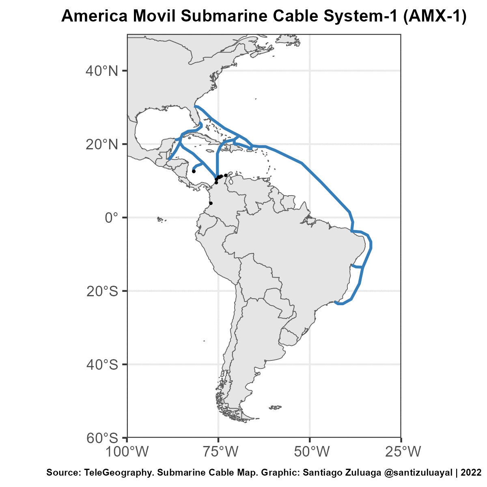
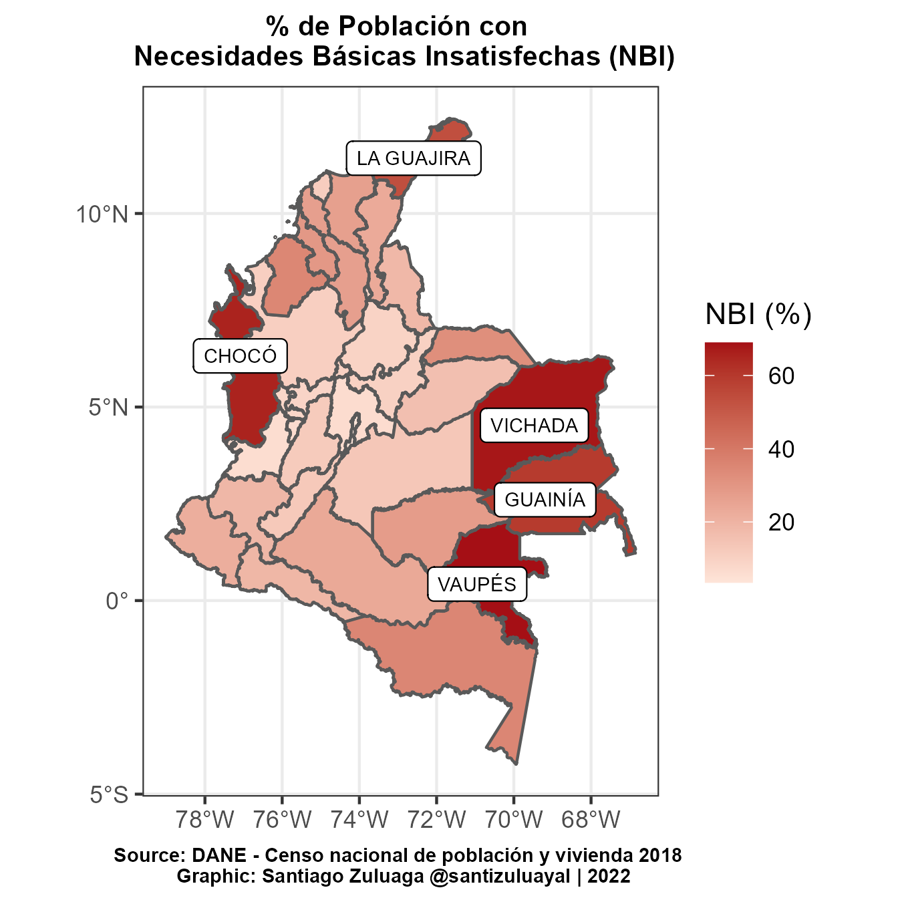
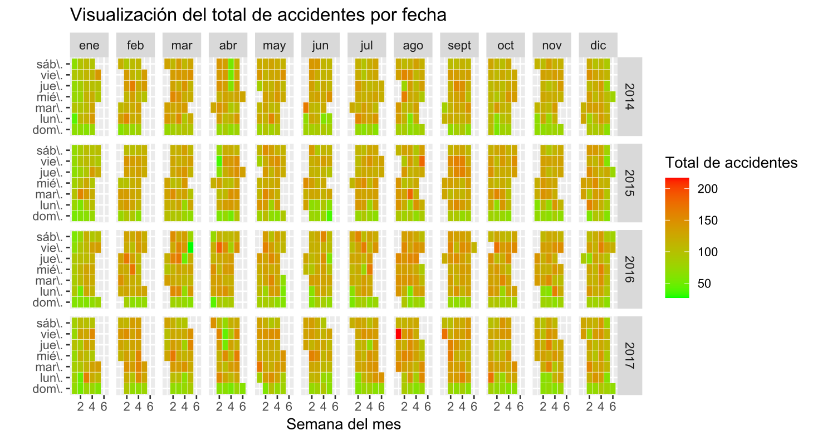

# Hola!

Soy Santiago, Estadístico de la Universidad Nacional de Colombia. Inmerso en el mundo de datos, me enfoco en el análisis y la ciencia de datos. Actualmente estoy mejorando  mis habilidades en ingeniería de Datos.

## Proyectos

 
 

## DataViz (Galería)

 
 
 
 
 
 
 
 
 

### ¡Conéctemos en la web! :earth_americas:

<a href="https://santiagozuluagaa.github.io/web/"> Sitio Web :computer: </a> 

 

 

 

<!--
- [Linkedin](https://www.linkedin.com/in/santiago-zuluaga-ayala/)
- [Sitio Web](https://santiagozuluagaa.github.io/web/)
**santiagozuluagaa/santiagozuluagaa** is a ✨ _special_ ✨ repository because its `README.md` (this file) appears on your GitHub profile.
Here are some ideas to get you started:
- 🔭 I’m currently working on ...
- 🌱 I’m currently learning ...
- 👯 I’m looking to collaborate on ...
- 🤔 I’m looking for help with ...
- 💬 Ask me about ...
- 📫 How to reach me: ...
- 😄 Pronouns: ...
- ⚡ Fun fact: ...
-->
